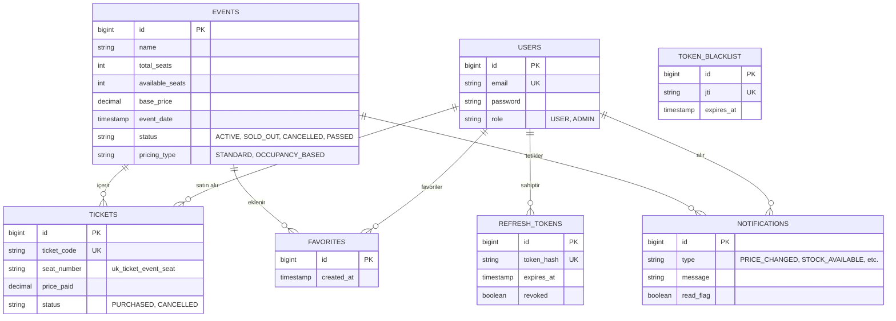

# 🎟️ Ticket System API (Bilet Satış & Yönetim Sistemi)


Bu proje, eşzamanlı bilet satış senaryolarını güvenli şekilde yönetmek için tasarlanmış, bildirimleri uygulama içindeki servis entegrasyonu üzerinden oluşturan kapsamlı bir **Backend API** sistemidir.

Standart CRUD işlemlerinin ötesine geçerek; **Veri tutarlılığı**, **Dinamik fiyatlandırma algoritmaları** ve **Gelişmiş JWT Güvenliği** gibi modern yazılım mühendisliği pratiklerini barındırır.

---

## 🚀 Öne Çıkan Mimari Özellikler (Engineering Highlights)

- **Eşzamanlılık Kontrolü (Pessimistic Lock):** Aynı anda bilet almak isteyen kullanıcılar arasında "Race Condition" oluşmaması için veritabanı seviyesinde `Pessimistic Lock` kullanılmış, aynı koltuğun iki kişiye satılması engellenmiştir.
- **Tasarım Kalıpları (Strategy Pattern):** Etkinliklerdeki doluluk oranına göre fiyatı dinamik olarak artıran algoritma (`OccupancyBasedPricingStrategy`), if-else bloklarına boğulmadan **Strategy Design Pattern** ile izole edilmiştir.
- **Entegre Bildirim Sistemi (Integrated Notifications):** Sistemdeki "Favoriler" modülü sadece bir listeleme aracı değildir. Etkinlik fiyatı veya tarihi değiştiğinde, etkinlik iptal edildiğinde ya da durum değiştiğinde favoriye alan kullanıcılara ve gerektiğinde bilet sahiplerine, ilgili servislerin doğrudan çağrılmasıyla veritabanına bildirim kaydı oluşturulur.
- **Gelişmiş JWT Güvenliği (Token Blacklist):** Çıkış yapan veya şifresi sıfırlanan kullanıcıların token'ları **Kara Listeye** alınır. İptal edilmiş tokenlarla erişim kalıcı olarak kesilir.
- **Performans Optimizasyonu (N+1 Problemi):** Binlerce bileti/bildirimi olan kullanıcılara ait listelemelerde ORM darboğazlarını önlemek için repository katmanında `JOIN FETCH` optimizasyonları yapılmıştır.

### 📊 Veritabanı İlişki Şeması (Entity Relationship Diagram)



---

## 🛠️ Kullanılan Teknolojiler

- **Backend:** Java 17, Spring Boot 3.3.2
- **Veritabanı:** PostgreSQL 16 (Hibernate 6.5 & Spring Data JPA)
- **Güvenlik:** Spring Security, JSON Web Token (JWT), BCrypt
- **Araçlar:** MapStruct (DTO Mapping), Lombok, Maven, Docker & Docker Compose
- **Dokümantasyon:** OpenAPI (Swagger 3)

---

## 📦 Kurulum ve Çalıştırma (Setup & Run)

### 1. Klonlama ve Ayarlar
```bash
git clone https://github.com/KULLANICI_ADINIZ/ticketsystem.git
cd ticketsystem

# Linux / macOS:
cp .env.example .env

# Windows (PowerShell):
Copy-Item .env.example .env
```
> **Önemli Güvenlik Notu:** Production ortamına çıkarken `.env` dosyasındaki `JWT_SECRET`, `ADMIN_PASSWORD` ve veritabanı şifrelerini güçlü ve benzersiz değerlerle değiştirin.

> **⚠️ Local Geliştirme Parolası:** `.env.example` içindeki `ADMIN_PASSWORD=ChangeMe123!` değeri **yalnızca yerel geliştirme ortamı içindir**. Uygulama başlangıcında otomatik admin hesabı oluşturmak için kullanılır. Bu değer production'da reddedilir; production deployment için farklı, güçlü bir parola belirlemeniz zorunludur.

---

### 2. Çalıştırma Seçenekleri

#### Seçenek A: Tamamen Docker ile Çalıştırma (Önerilen)
Tüm servisler (PostgreSQL ve Spring Boot uygulaması) Docker üzerinde ayağa kalkar:
```bash
docker compose up --build
```

#### Seçenek B: Yerel Geliştirme Modu (Sadece DB Docker'da, Uygulama Yerel)
Yalnızca veritabanını Docker'da başlatıp uygulamayı yerel makinenizde çalıştırabilirsiniz:
```bash
# 1. Yalnızca PostgreSQL'i başlatın:
docker compose up -d postgres

# 2. Spring Boot uygulamasını başlatın:
./mvnw spring-boot:run
```

---

### 3. API Dokümantasyonu (Swagger)
Proje başarıyla başladığında **Swagger API Dokümantasyonuna** şu adresten ulaşabilirsiniz:
👉 **[http://localhost:8080/swagger-ui/index.html](http://localhost:8080/swagger-ui/index.html)**

---

### 4. Otomatik Canlı Test Paketi (Automated API Test Suite)
Sistem çalışırken tüm 26 REST endpoint'ini (Authentication, Event Lifecycle, Pessimistic Lock, Bilet Satın Alma/İptal, Bildirimler ve Temizlik) tek bir PowerShell komutuyla otomatik olarak test edebilirsiniz:

```powershell
# Windows PowerShell:
powershell -ExecutionPolicy Bypass -File .\test_all_apis.ps1 -AdminPassword 'ChangeMe123!'
```
> Script sırasıyla; Admin ve User oturum açma, profil güncelleme, etkinlik CRUD, dinamik fiyatlandırma, bilet alma (sıralı koltuk atama), bilet iptal (koltuk iadesi), favorileme ve bildirim akışlarını test eder.

---

## 🔌 API Uç Noktaları (Endpoints)

Tüm API uç noktaları Swagger arayüzü üzerinden interaktif olarak test edilebilir.

### 🔐 Kimlik Doğrulama (Auth)
| Metot | Uç Nokta | Açıklama |
| :--- | :--- | :--- |
| `POST` | `/api/v1/auth/register` | Sisteme yeni kullanıcı kaydeder. |
| `POST` | `/api/v1/auth/login` | Giriş yapar. Access ve Refresh Token döner. |
| `POST` | `/api/v1/auth/refresh` | Süresi dolan Access token'ı yeniler (Refresh Token Rotation). |
| `POST` | `/api/v1/auth/logout` | Token'ı kara listeye alarak güvenli çıkış yapar. |

### 🎭 Etkinlikler (Events)
| Metot | Uç Nokta | Açıklama |
| :--- | :--- | :--- |
| `GET` | `/api/v1/events` | Tüm etkinlikleri listeler. |
| `GET` | `/api/v1/events/active` | Satışa açık olan etkinlikleri listeler. |
| `GET` | `/api/v1/events/{id}` | Etkinlik detayını getirir. |
| `GET` | `/api/v1/events/status/{status}` | Durumuna göre etkinlikleri filtreler (`ACTIVE`, `SOLD_OUT`, `CANCELLED`, `PASSED`). |
| `GET` | `/api/v1/events/search?keyword=...` | İsme göre etkinlik arar. |
| `POST` | `/api/v1/events` | **(ADMIN)** Yeni bir etkinlik ekler (Dinamik/Sabit fiyat). |
| `PUT` | `/api/v1/events/{id}` | **(ADMIN)** Etkinlik detaylarını tam günceller. |
| `PATCH` | `/api/v1/events/{id}` | **(ADMIN)** Etkinlik detaylarını kısmi günceller. |
| `DELETE`| `/api/v1/events/{id}` | **(ADMIN)** Etkinliği siler. |

### 🎫 Biletler (Tickets)
| Metot | Uç Nokta | Açıklama |
| :--- | :--- | :--- |
| `POST` | `/api/v1/tickets/buy` | Etkinliğe bilet alır (Pessimistic Lock & Otomatik Sıralı Koltuk Ataması). |
| `POST` | `/api/v1/tickets/{id}/cancel` | Bileti iptal eder ve koltuğu sisteme iade eder (Idempotent). |
| `GET` | `/api/v1/tickets/my` | Kullanıcının satın aldığı tüm biletleri listeler (Alias: `/my-tickets`). |
| `GET` | `/api/v1/tickets/{id}` | Bilet detayını getirir (Bilet sahibi veya ADMIN). |
| `GET` | `/api/v1/tickets/user/{userId}` | **(ADMIN)** Belirli bir kullanıcının biletlerini listeler. |

### ❤️ Favoriler (Favorites)
| Metot | Uç Nokta | Açıklama |
| :--- | :--- | :--- |
| `POST` | `/api/v1/favorites/{eventId}` | Etkinliği favorilere ekler (Tükendiğinde/fiyat değiştiğinde bildirim almak için). |
| `DELETE`| `/api/v1/favorites/{eventId}` | Etkinliği favorilerden çıkarır. |
| `GET` | `/api/v1/favorites` | Kullanıcının favori listesini getirir. |
| `GET` | `/api/v1/favorites/{eventId}/check` | Etkinliğin favorilerde olup olmadığını kontrol eder. |

### 🔔 Bildirimler (Notifications)
| Metot | Uç Nokta | Açıklama |
| :--- | :--- | :--- |
| `GET` | `/api/v1/notifications` | Kullanıcının tüm bildirimlerini sayfalı listeler (`size` sınırı: 50). |
| `GET` | `/api/v1/notifications/unread` | Okunmamış sistem bildirimlerini listeler. |
| `GET` | `/api/v1/notifications/unread-count` | Okunmamış bildirim adedini döner. |
| `POST` | `/api/v1/notifications/{id}/read` | Bildirimi "okundu" olarak işaretler. |
| `POST` | `/api/v1/notifications/read-all`| Tüm bildirimleri tek tıkla okundu yapar. |

### 👤 Kullanıcılar (Users)
| Metot | Uç Nokta | Açıklama |
| :--- | :--- | :--- |
| `GET` | `/api/v1/users/me` | Giriş yapmış kullanıcının profil detaylarını getirir. |
| `PUT` | `/api/v1/users/me` | Giriş yapmış kullanıcının profil bilgilerini günceller. |
| `GET` | `/api/v1/users` | **(ADMIN)** Sistemdeki tüm kullanıcıları listeler. |
| `GET` | `/api/v1/users/{id}` | **(ADMIN)** Kullanıcı detayını getirir. |

---

## ⚖️ İş Kuralları ve Güvenlik Standartları (Business Rules)

- **📈 Dinamik Fiyatlandırma Algoritması (`OccupancyBasedPricingStrategy`):**
  - Doluluk Oranı $\ge \%80$ ise: $\text{Taban Fiyat} \times 1.50$
  - Doluluk Oranı $\ge \%50$ ise: $\text{Taban Fiyat} \times 1.20$
  - Doluluk Oranı $<\%50$ ise: $\text{Taban Fiyat}$ (Standart)
- **🔒 Eşzamanlı Bilet Satışı ve İptali:**
  - Bilet alımı esnasında `Event` kaydı `PESSIMISTIC_WRITE` ile kilitlenir, koltuk ataması otomatik yapılır (`KOLTUK-1`, `KOLTUK-2` ...).
  - Bilet iptali esnasında **Double-Check Lock** paterniyle hem `Ticket` hem de `Event` kilitlenir; iptal edilen koltuk numarası `-CANCELLED-{id}` son eki alarak serbest bırakılır ve kapasite güvenle $+1$ artırılır.
- **🕒 Zamanlanmış Arka Plan Görevleri (Scheduled Jobs):**
  - **`EventStatusJob`:** Her 60 saniyede bir çalışarak etkinlik tarihi geçmiş `ACTIVE` veya `SOLD_OUT` etkinlikleri otomatik olarak `PASSED` durumuna çeker. Satın alınmış biletler kullanıcı geçmişi ve kanıt amacıyla `PURCHASED` durumunda güvenle saklanır.
  - **`TokenCleanupJob`:** Her gece 03:00'da çalışarak süresi dolmuş refresh token kayıtlarını ve kara listedeki süresi bitmiş access tokenları temizler.

---

## 👨‍💻 Geliştirici & Lisans

Bu proje **Yakup Yılmaz** tarafından modern yazılım mühendisliği prensipleri ve en iyi backend pratikleri uygulanarak geliştirilmiştir.  
Lisans: [MIT License](LICENSE)

